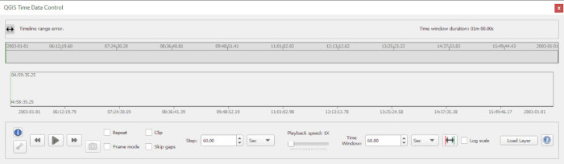
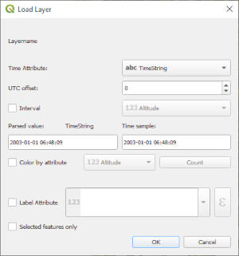
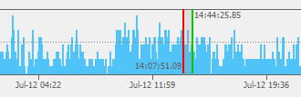
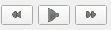
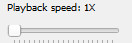

## QGIS Time Data Control (QTDC) Plugin

The QGIS Time Data Control (QTDC) is a plugin component that adds an 
interactive data animation capability to QGIS.  This gives 
users the ability to display and animate time tagged map data in 
temporal context on the QGIS map display and renders it on top of 
any base map data present.  It also provides a histogram timeline 
representation of the data in the temporal domain that also serves 
as the primary user interface control for interactive data
animation.

### Installation

Using the QGIS Plugin Manager's **Install from zip** option, install 
the file 'QgisTDC.zip' located in the "Releases" area of this repository.

### Quick Start

Launch QGIS and load a layer that has a time attribute.
(ex., [USGS earthquake data](https://earthquake.usgs.gov/earthquakes/search/).)
 
Zoom the map to the layer.

Activate the QTDC UI with its toolbar button  or by selection from the 
**Plugins** menu

Select the layer in the layer pane (the name should be highlighted).

Click the **Load layer** button on the QTDC UI.  
In the load dialog select the attribute containing time in the **Time Attribute** combo box.  

  

Inspect the sample and parsed time values in the dialog for verification.  
Click the **OK** button.

When the timeline histogram has updated, click the mouse on the histogram 
to position the data time window.
    *(Make sure the map is zoomed to the layer.)*
The data time window is the shaded area bordered by red and green vertical lines.

	
Operate the play buttons to animate the data.  

  

Use the **Playback Speed** slider to adjust animation speed.  

  

The data time window  can also be dragged along the timeline to manually 
animate or set its position. 

Further information on timeline manipulation can be displayed with the 
**Timeline Interaction Info** button  on the lower left of the QTDC UI.

Click the **Help** button  on the lower right or select the 
*Plugins->QTDC->Help* menu to display QTDC help.
 
### Notice:
Portions of this software were produced for the U. S. Government under Contract No. FA8702-19-C-0001 
and W56KGU-18-D-0004, and is subject to the Rights in Noncommercial Computer Software
and Noncommercial Computer Software Documentation Clause DFARS 252.227-7014 (FEB 2014)  
(c) 2022 The MITRE Corporation  

